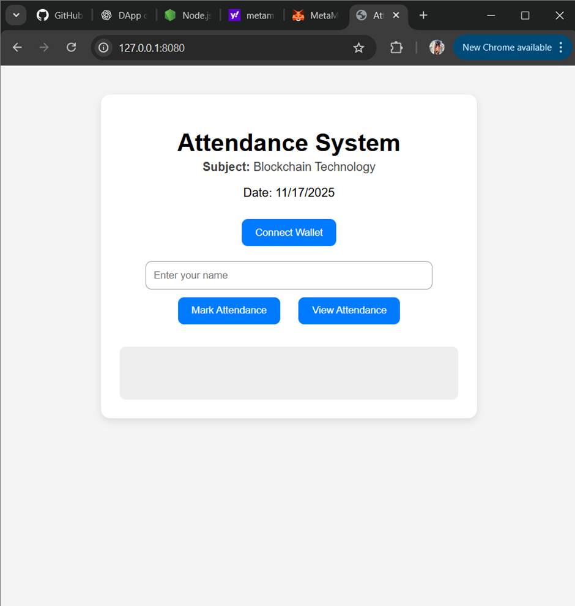
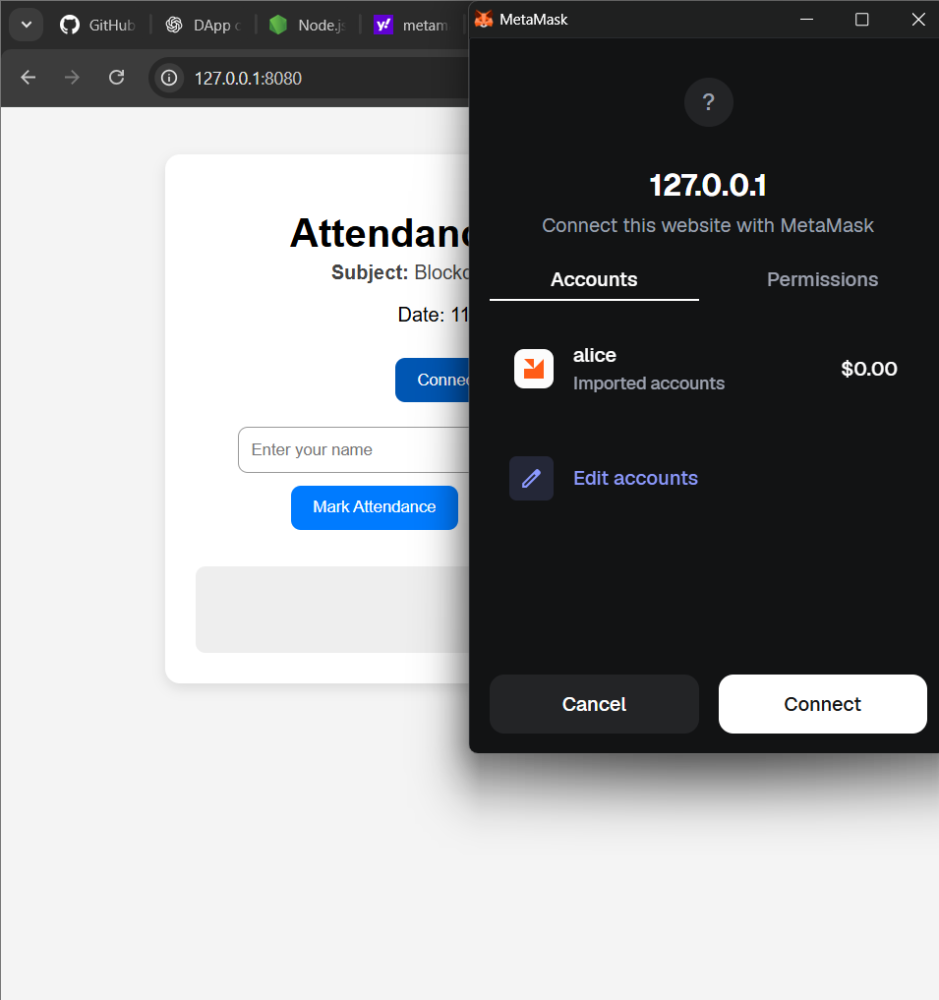
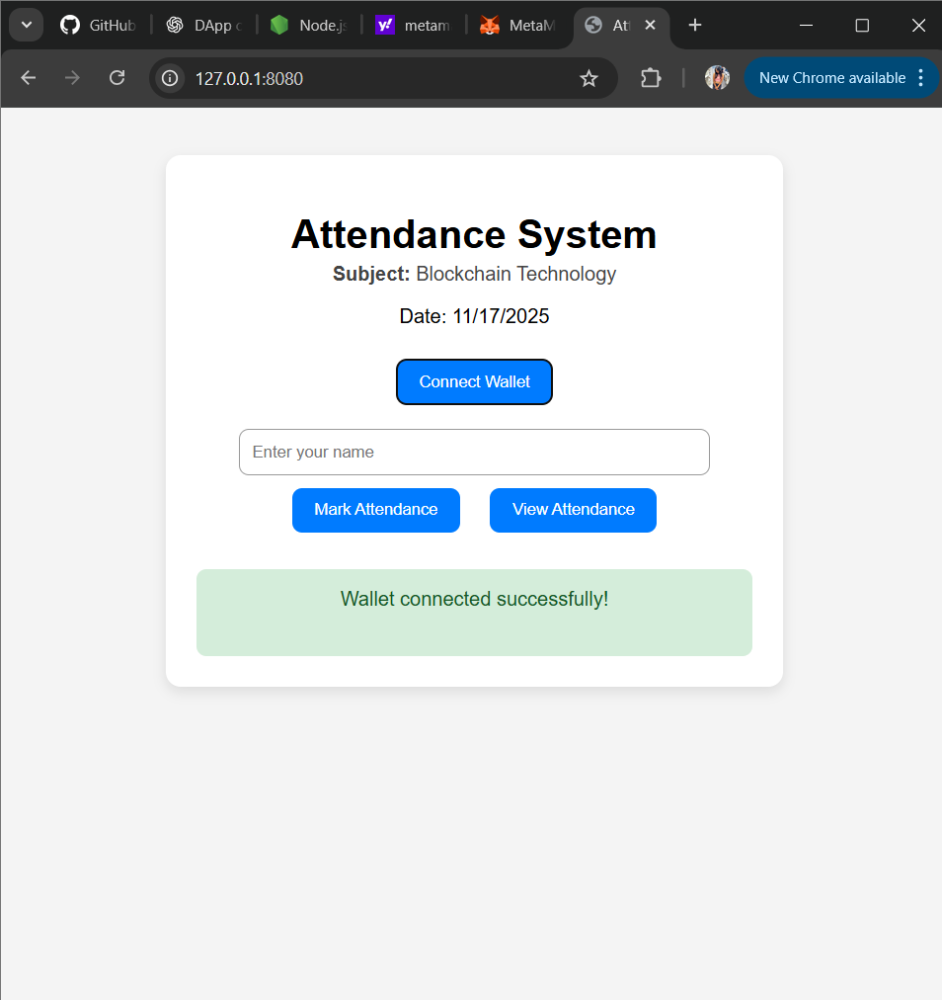
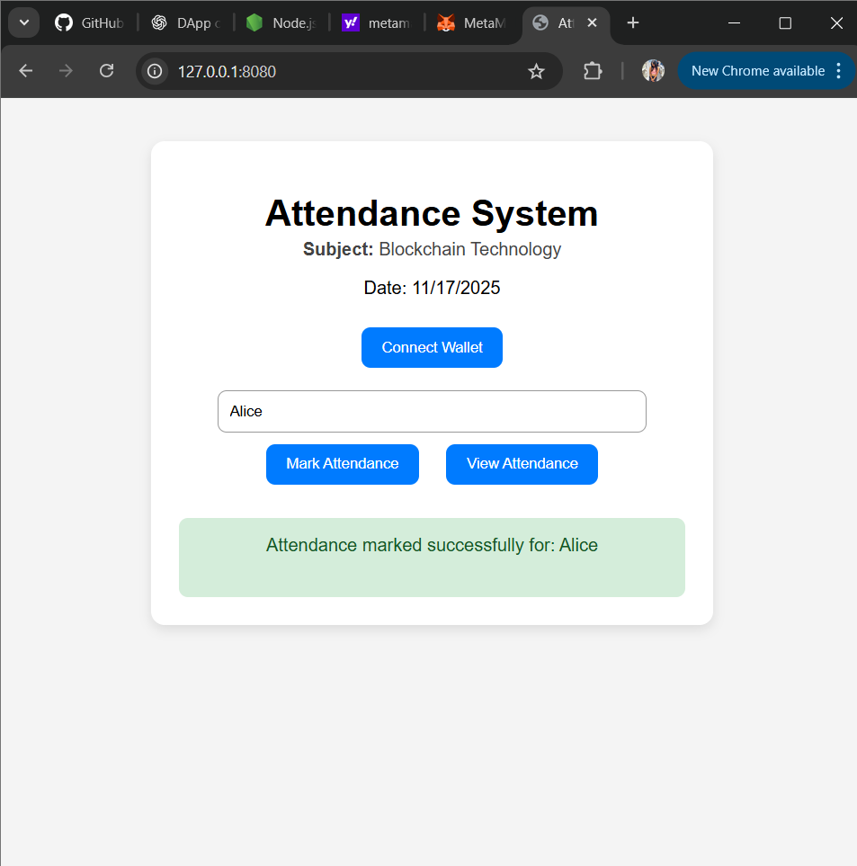
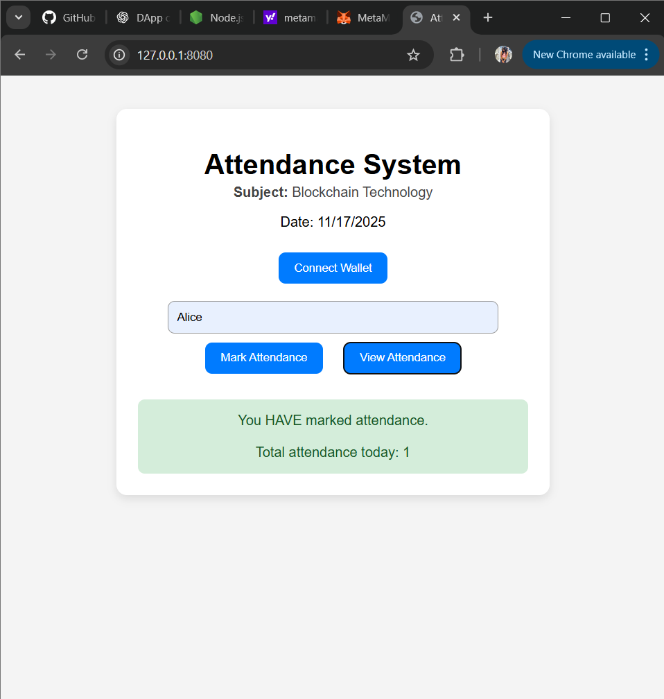

A decentralized attendance system built using Solidity, Hardhat (TypeScript), Ethers.js, and a simple HTML/CSS/JS frontend.
Students can mark attendance using their wallet, and the teacher can view the complete attendance list.

Features
For Teacher
•	Deploys and owns the smart contract
•	Can view complete attendance list (names + wallet addresses)
•	Can verify attendance of any student
 For Students
•	Connect wallet
•	Mark attendance with their name
•	Check whether they have already marked attendance
•	Verify their presence instantly

Technologies Used
•	Solidity (Smart contract)
•	Hardhat + TypeScript
•	Ethers.js (BrowserProvider)
•	Metamask
•	HTML + JavaScript frontend
•	Local Hardhat blockchain

Setup Instructions
Clone the Repository
git clone https://github.com/sreelakshmi-suneesh/attendance-dapp.git
cd attendance-dapp

Backend Setup (Hardhat + TypeScript)
Install Dependencies
npm install

Start the Hardhat Local Blockchain
npx hardhat node
Keep this terminal running.

Deploy the Smart Contract
Open a new terminal (don’t close the node) and run:
npx hardhat run scripts/deploy.ts --network localhost
You will get an output like:
Attendance deployed to: 0x5FbDB2315678afecb367f032d93F642f64180aa3

Update Frontend Config
Go to:
frontend/config.js
Update:
export const contractAddress = "PASTE_DEPLOYED_ADDRESS_HERE";

Start Frontend Server
If you have lite-server installed:
npx lite-server
Or using http-server:
npx http-server
Your DApp will open in the browser.

How to Use the DApp
Student Actions
1.	Open the website
2.	Connect wallet
3.	Enter your name
4.	Click Mark Attendance
5.	To verify your attendance → Click View Attendance
	Shows whether you marked or not
	Shows total students count also

Smart Contract Summary
Contract: Attendance.sol
•	Stores student names
•	Prevents duplicate attendance
•	Tracks attendance count
•	Stores student list
•	Teacher-only view for full attendance

## Screenshots

### 🏠 Homepage

### 🔗 Connecting Wallet

### ✅ Wallet Connected

### 📝 Marking Attendance

### 👀 Viewing Attendance

